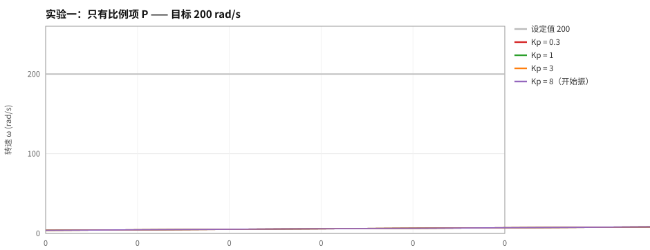
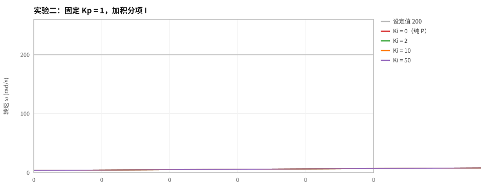
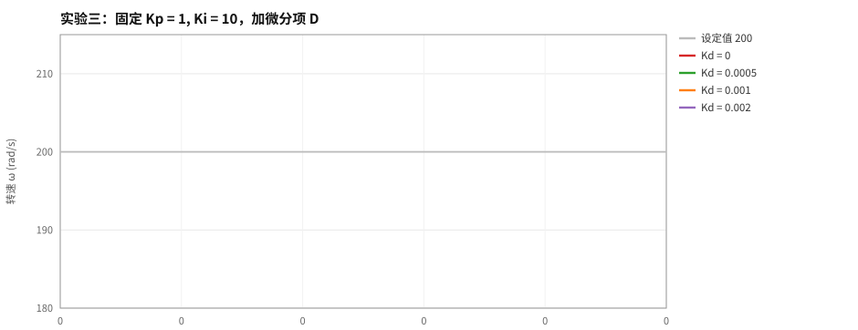
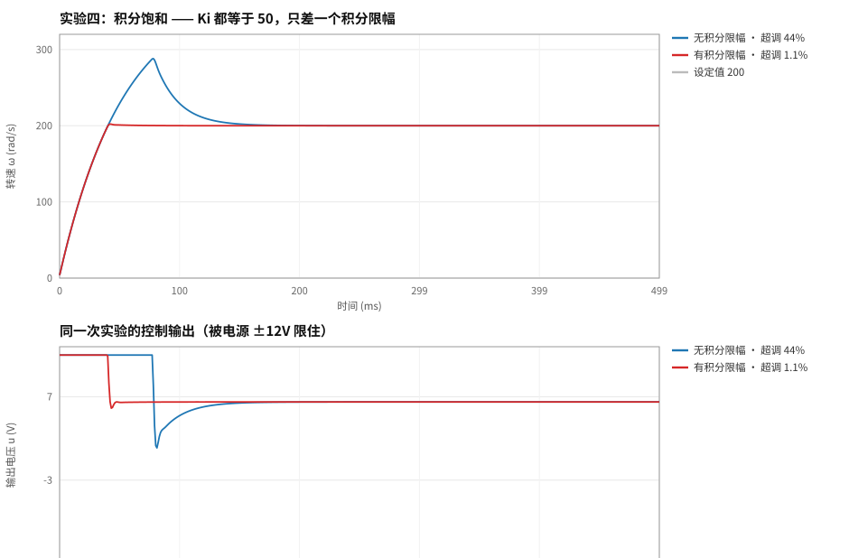
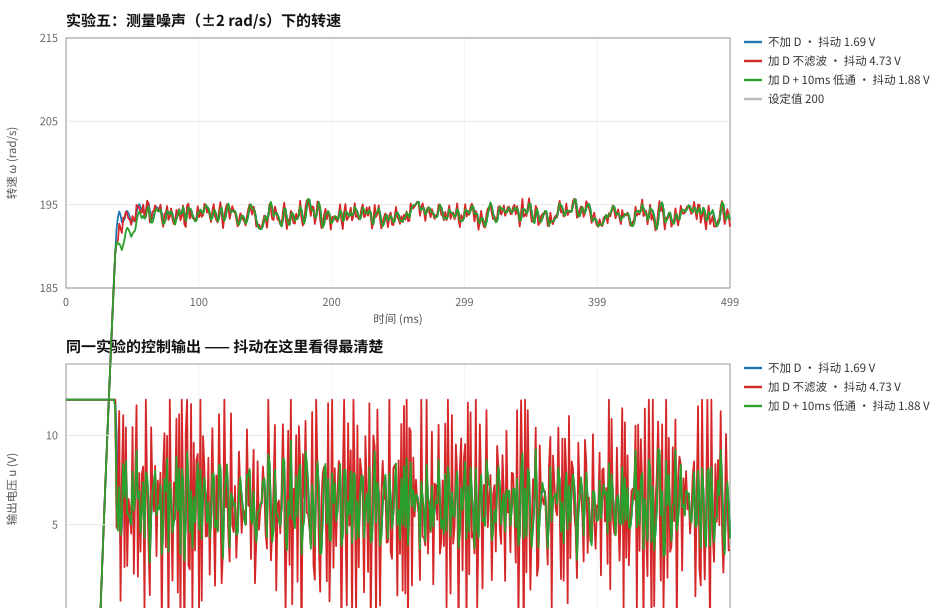

# 09 · PID 控制原理与参数整定：用仿真把每个参数搞明白

> **本章目标**：说清楚 P、I、D 各自在干什么，为什么会那样，并且**能用数据证明**自己的说法。
> **前置章节**：[04 定时器与 PWM](04-定时器与PWM.md) · [07 ADC 采样](07-ADC采样.md)
> **硬件**：不需要硬件。本章是纯 PC 仿真，`gcc` 编译即可运行。
> **代码**：[`code/06-pid-sim`](../code/06-pid-sim)
> **状态**：✅ 代码已编译运行，数据与曲线均由程序生成

---

## 1. 先想清楚一个问题

PID 只有三个参数，为什么无数人栽在上面？

我的理解是：**因为它太"好上手"了**。随便给三个数，系统多半能动；于是很多人就停在"能动"，
从没搞清楚 Kp 从 1 加到 2 到底改变了什么。

所以我给自己定了个规矩：**先不碰板子**。
板子上你一次只能试一组参数，改一次要重编译下载，一组 30 秒，试 16 组就是 8 分钟，
而且中间还夹着"这次电池电压低了""电机发热了"这些干扰变量，你根本分不清差异是谁造成的。

仿真里被控对象是**固定的**，于是 Kp 变化引起的差异**一定来自 Kp**。
这叫控制变量法。先把参数扫出大致范围，再上板子微调。

---

## 2. 原理：它到底是怎么工作的

### 2.1 PID 在算什么

设目标值 `r`、实际测量值 `y`，误差 `e = r − y`。位置式 PID 的输出：

```text
u(t) = Kp·e(t) + Ki·∫e(τ)dτ + Kd·de(t)/dt
```

三项各管一件事，这是本章要证明的核心命题：

| 项 | 管什么 | 代价 |
|---|---|---|
| **P** 比例 | 消掉一部分误差，误差越大出力越大 | 永远消不干净（稳态误差）；给太大开始振荡 |
| **I** 积分 | 把误差"攒起来"，**最终把稳态误差消到零** | 引入超调；输出饱和时会"积分饱和" |
| **D** 微分 | 误差变化太快时提前踩刹车，**压超调** | 放大测量噪声，可能让执行器发抖 |

### 2.2 离散化：为什么 ki 要乘 dt

单片机里没有积分和微分，只有加减乘除。所以要做离散化：

```text
u[k] = Kp·e[k] + Ki·dt·Σ e[j] + Kd·(e[k] − e[k−1]) / dt
```

注意我把 `Ki` 写成了 `Ki·dt·Σe`，而不是常见的 `Ki·Σe`。

**这不是写法差异，是量纲问题。** 写成 `Ki·dt·Σe` 时，`Ki` 的量纲是 `1/s`，
换个采样率（比如从 1kHz 改成 500Hz）参数**不用重调**；
写成 `Ki·Σe` 时 `Ki` 的量纲依赖采样周期，换采样率就得重调一遍。
我选前者。

同理，`Kd` 除以 `dt` 之后，量纲是**秒**。这就解释了一个新手常见的困惑：
"为什么别人的 Kd 是 0.5，我这里只能给 0.0005？"
——因为他们的公式里没有除以 `dt`。**看别人的参数前，先看他的公式。**

### 2.3 三件工程上必须加的东西

教科书上的 PID 是上面的公式，直接拿去做机器人**一定会出事**。真实的实现要加三个东西：

**(1) 输出限幅** —— 执行器有物理上限。电源只有 12V，PWM 占空比最大 100%，
不限幅的话"算出来的 200V"是假的，但积分项会照着这 200V 继续涨。

**(2) 积分限幅（抗积分饱和 / anti-windup）** —— 这是最容易出事的一条。

假设输出已经顶在 12V 上限，误差却还是同方向（比如还在加速中），
积分项就会继续往上滚。等转速冲过目标、误差反向时，**必须先把这一大坨积分"还清"
才能真正反向**，表现就是：超调巨大、回调极慢。
本章实验四用数据证明了这件事——**超调从 44% 降到 1.1%，唯一的改动就是加了一个积分限幅**。

**(3) 微分先行 + 微分低通滤波**

微分先行：不对误差 `e` 微分，而是对**测量值 `y`** 微分再取负号。
因为设定值突变时 `e` 会跳变，`de/dt` 理论上无穷大 → 输出瞬间打满 → 电机"咔"一下。
`y` 是连续变化的物理量，对它微分不会有这个冲击。

微分低通滤波：这个是我**被数据打脸之后才加的**，见第 7 节。

### 2.4 被控对象：我没有用"一阶惯性环节"糊弄

要仿真就得有被控对象。很多教程直接用一个一阶惯性环节 `τ·dy/dt + y = K·u` 完事。
我没这么做，因为一阶环节里"给电压转速立刻开始涨"，看不出**电感带来的电流滞后**——
而真机上调电流环时，电感 `L` 恰恰是最要命的参数。

所以我老老实实写了有刷直流电机的**电气 + 机械双状态模型**：

```text
L·di/dt  = u − R·i − Ke·ω        （电气方程，电感决定电流跟不上电压突变）
J·dω/dt  = Kt·i − B·ω − T_load   （机械方程，惯量决定转速跟不上转矩）
```

参数取一台 12V 带减速箱的小型直流电机（输出轴侧折算）：

| 参数 | 值 | 说明 |
|---|---|---|
| R | 1 Ω | 电枢电阻 |
| L | 0.5 mH | 电枢电感 |
| Ke = Kt | 0.0318 V·s/rad | 约为空载 300 rpm/V |
| J | 5.5e-5 kg·m² | 折算转动惯量 |
| B | 1e-6 N·m·s/rad | 粘性摩擦 |

**整定前先算两个时间常数**（这是调 PID 之前的必修课）：

```text
电气时间常数  τe = L / R          = 0.5 ms
机械时间常数  τm = J·R / (Kt·Ke)  = 54.3 ms
```

程序跑完会自动打印这两个数（见第 8 节输出）。

`τm / τe ≈ 109`，相差两个数量级 —— 这正是"转速环可以当成一阶惯性环节来调"的根据。
**但如果偷懒把物理积分步长取成 1ms，`dt/τe = 2` 就正好踩在前向欧拉法的稳定边界上，
仿真会直接发散。**我的物理步长取 20µs，`dt/τe = 0.04`，离边界很远。
这是写数值仿真必须先想清楚的事。

仿真结构：控制周期 **1ms（1kHz，RM 上常见的控制频率）**，物理积分步长 **20µs**，
即每个控制周期内做 50 次物理积分。

### 2.5 实验设计：每组只改一个变量

18 组场景，分五个实验：

| 实验 | 变量 | 对照组 |
|---|---|---|
| 一 | Kp | 0.3 / 1 / 3 / 8 |
| 二 | Ki（Kp 固定 1） | 0 / 2 / 10 / 50 |
| 三 | Kd（Kp=1, Ki=10） | 0 / 0.0005 / 0.001 / 0.002 |
| 四 | 积分限幅（Ki=50） | 关 / 开 |
| 五 | 微分滤波（噪声 ±2 rad/s） | 无 D / 有 D / D+2ms / D+10ms |

---

## 3. 依据与参考资料

这一章不是从数据手册里抄的（PID 不是外设），所以把"依据"单独列清楚，
方便你判断我的说法站不站得住：

| 结论 | 依据 |
|---|---|
| 离散化形式 `Ki·dt·Σe` 与 `Kd·Δy/dt` | 位置式 PID 的标准离散化。**注意不同资料的 `Ki`/`Kd` 定义不同**——我选择让 `Ki` 量纲为 1/s、`Kd` 量纲为 s，这样换采样率不用重调参数 |
| 微分先行（derivative on measurement） | 标准做法，用于避免设定值阶跃时的微分冲击（derivative kick） |
| 积分限幅 / 反算抗饱和 / 条件积分 | 抗积分饱和（anti-windup）的三类常见方案，我实现的是最朴素的第一种 |
| 直流电机双状态模型 | 有刷直流电机的标准数学模型；`Kt = Ke`（国际单位制下）是理想电机的结论 |
| 前向欧拉法的稳定性条件 `dt < 2τ` | 数值分析里一阶显式方法的稳定域结论，用来确定物理积分步长 |
| 滤波器系数 `α = dt/(τ+dt)` | 一阶 IIR 低通（指数加权移动平均）的标准形式 |
| 一阶惯性环节的稳态增益、时间常数 | 经典控制理论 |

**参考资料**（都是公开的、可以自己去核）：
- 江协科技 STM32 入门教程里关于定时器与中断的部分（控制周期怎么定）
- [RoboMaster 社区](https://bbs.robomaster.com/) 各校战队关于电控整定的技术帖
- 课程教材：自动控制原理里的 PID 章节

> ⚠️ 有一点我必须说明：**上面的"依据"里没有一条是"别人说这样能行"。**
> 本章所有结论后面都跟着本仓库 `data/` 目录里的原始数据和 `assets/` 里的曲线。
> 你可以不同意我写的任何一句，但数据在那儿，自己改参数重跑一遍就能验证。

---

## 4. 数据与结论

以下全部是 `pidsim` 真实运行输出，`data/` 目录里有原始 CSV，图由 `plot.py` 从 CSV 生成。

### 实验一：比例项 P —— 误差永远消不干净，而且给大了会振



| 场景 | Kp | 上升时间 | 超调 | **稳态误差** | 调节时间 | 输出纹波 | 输出抖动 |
|---|---|---|---|---|---|---|---|
| P_kp0.3 | 0.3 | 40.0 ms | 0.0% | **19.20 rad/s** | 未进带 | 0.00 V | 0.000 V |
| P_kp1 | 1.0 | 32.0 ms | 0.0% | **6.18 rad/s** | 未进带 | 0.00 V | 0.000 V |
| P_kp3 | 3.0 | 32.0 ms | 0.0% | **2.10 rad/s** | 39.0 ms | 0.00 V | 0.000 V |
| P_kp8 | 8.0 | 32.0 ms | 0.9% | **1.21 rad/s** | 444.0 ms | **19.93 V** | **9.202 V** |

**结论 1：Kp 越大，稳态误差越小 —— 但永远消不到零。**
误差从 19.20 → 6.18 → 2.10 → 1.21 rad/s，单调下降但始终为正。

为什么消不掉？因为 P 控制的稳态必须是"有误差才有输出"。
设目标 200 rad/s、电机电压-转速增益约 31.4 rad/s/V，
要维持 200 rad/s 就需要约 6.4V；而 `u = Kp·e`，Kp=1 时必须有 `e = 6.4 rad/s` 才凑得出这个 6.4V。
**这就是纯 P 的宿命：稳态误差 = 稳态所需输出 / Kp。**

**结论 2：Kp 太大会振荡。**
Kp=8 时稳态误差确实更小了，但输出纹波从 0 涨到 **19.93 V**（满量程 ±12V 的 83%），
输出抖动 9.2 V，调节时间反而变长到 444 ms。它在极限环里来回打。

原因：Kp=8 时环路增益 `Kp × 31.4 = 251`，闭环带宽约 `251 / τm ≈ 4600 rad/s`，
**已经超过 1kHz 采样率对应的奈奎斯特频率（500 Hz = 3140 rad/s）**，
离散系统稳不住。这条经验很实用：**控制周期是硬约束，它限死了你能用多大的增益。**

### 实验二：积分项 I —— 唯一能把稳态误差干到零的东西



| 场景 | Kp | Ki | 超调 | **稳态误差** | 调节时间 |
|---|---|---|---|---|---|
| PI_ki0 | 1.0 | 0 | 0.0% | **6.18 rad/s** | 未进带 |
| PI_ki2 | 1.0 | 2 | 0.9% | **−0.48 rad/s** | 39.0 ms |
| PI_ki10 | 1.0 | 10 | 3.0% | **−0.08 rad/s** | 74.0 ms |
| PI_ki50 | 1.0 | 50 | 2.9% | **−0.00 rad/s** | 48.0 ms |

**结论 3：只要加上一点点 I，稳态误差就掉了一个数量级。**
Ki=0 时 6.18 rad/s，Ki=2 直接变成 −0.48（误差还反向了一点点，正是积分超调的体现），
Ki=50 时基本为 0。

**结论 4：I 的代价是超调和振荡。**
超调从 0% → 0.9% → 3.0%。Ki 越大，积分"攒"得越快，冲过头越狠。
注意 Ki=50 的超调（2.9%）反而比 Ki=10（3.0%）略小、调节时间更短，
这是因为它更快进入饱和又被输出限幅削平了 —— **这其实是个危险信号**，
说明此时系统行为已经主要被限幅决定了，不是正常的线性响应。实验四会解释这件事。

### 实验三：微分项 D —— 压超调，但效果温和



| 场景 | Kp | Ki | Kd | **超调** | 调节时间 |
|---|---|---|---|---|---|
| PID_kd0 | 1.0 | 10 | 0 | **2.96%** | 74.0 ms |
| PID_kd0005 | 1.0 | 10 | 0.0005 | **2.60%** | 75.0 ms |
| PID_kd001 | 1.0 | 10 | 0.0010 | **2.55%** | 76.0 ms |
| PID_kd002 | 1.0 | 10 | 0.0020 | **2.49%** | 79.0 ms |

**结论 5：D 确实单调地压超调，但幅度不大（2.96% → 2.49%），代价是调节时间略增。**

这一点和很多教程给人的印象不同。原因是我这个被控对象的时间常数区分得很开
（τm/τe ≈ 109），本身超调就不严重，D 没什么发挥空间。
**D 的用武之地是"惯性大、超调严重"的系统**——比如 RM 的云台位置环、机械臂关节。
在 1kHz 的转速环里 D 的作用通常很有限，这也是为什么很多队伍的转速环干脆只用 PI。

> ⚠️ 顺带记住：`Kd` 的数值小是**量纲决定的**（秒），不是"没调大"。
> 对比别人的参数前，先确认对方的公式有没有除以 `dt`。

### 实验四：积分饱和 —— 本章最有价值的一组数据



两组参数**完全相同**（Kp=1, Ki=50），唯一差别是**有没有给积分项限幅**：

| 场景 | 超调 | 调节时间 | 说明 |
|---|---|---|---|
| 关闭积分限幅 | **44.0%** | 139.0 ms | 积分一路涨到天上 |
| 打开积分限幅（±8） | **1.1%** | 39.0 ms | 正常 |

**结论 6：只加了一个积分限幅，超调从 44.0% 降到 1.1%，整整 40 倍。**

看上面那张图的下面板（控制输出）就明白发生了什么：
- 蓝线（无限幅）：起步电压顶在 12V 上直到转速冲过目标，然后**积分项还欠着一大笔债**，
  输出被拉到 **−2V** 去"还债"，这一下拉得转速掉头，来回振荡
- 红线（有限幅）：积分最多攒到 8V 就被卡住，输出平稳地落到稳态约 6.4V

这就是"积分饱和"的完整因果链：
**输出饱和 → 误差仍同号 → 积分继续累积 → 误差反向时需先清空积分 → 大幅超调。**

### 实验五：微分噪声 —— 我因此改了代码



给测量值加 ±2 rad/s 的随机噪声（相当于编码器量化误差或电磁干扰），
基准取 Ki=0 以便**把"积分项对噪声随机游走"这个干扰因素排除掉**，
剩下的差异就纯粹是 D 项造成的：

| 场景 | Kp | Kd | 滤波 τ | 输出纹波 | **输出抖动** |
|---|---|---|---|---|---|
| noise_nod | 1.0 | 0 | — | 5.48 V | **1.686 V** |
| noise_d | 1.0 | 0.001 | 无 | 12.85 V | **4.727 V** |
| noise_d_f2 | 1.0 | 0.001 | 2 ms | 7.48 V | **2.499 V** |
| noise_d_f10 | 1.0 | 0.001 | 10 ms | 5.85 V | **1.881 V** |

**结论 7：加 D 但不滤波，输出抖动从 1.69 V 放大到 4.73 V（2.8 倍）；加 10ms 低通后回落到 1.88 V，几乎回到不加 D 的水平。**

为什么 D 对噪声这么敏感？因为

```text
d = −Kd · (y[k] − y[k−1]) / dt
```

`dt` 只有 1ms，**等于把测量噪声放大了 1000 倍再乘以 Kd**。
噪声里那些高频成分本来就是"上一毫秒 +2、这一毫秒 −2"的跳变，除上 1ms 就成了 ±4000。

这里的教训是：**D 项不能单独存在，它必须配低通滤波。**
滤波时间常数 `τ` 取采样周期的 3~10 倍比较合适（1ms 采样 → 3~10ms）。
代价是相位滞后，`τ` 太大会削弱 D 的"提前刹车"作用。

---

## 5. 完整代码

代码在 [`code/06-pid-sim`](../code/06-pid-sim)，四个文件：

| 文件 | 作用 |
|---|---|
| `pid.h` / `pid.c` | PID 控制器本体。**不含任何 STM32/HAL 依赖**，可以直接搬进单片机工程 |
| `plant.h` / `plant.c` | 直流电机双状态模型 + 前向欧拉积分 |
| `sim.c` | 仿真主程序：18 组场景、性能指标计算、CSV 输出 |
| `plot.py` | 读 CSV 画成 SVG（纯 Python，零第三方依赖） |

`pid.c` 的核心：

```c
float PID_Update(PID_t *pid, float measurement, float dt)
{
    float error, p, d_raw, d, out;

    if (dt <= 0.0f) dt = 1e-3f;      /* 防御：dt 为 0 会让积分和微分出错 */
    if (dt >  0.5f) dt = 0.5f;       /* 防御：采样间隔异常 */

    error = pid->setpoint - measurement;

    /* ---- 比例项 ---- */
    p = pid->kp * error;

    /* ---- 积分项：带限幅，这是抗积分饱和的关键 ---- */
    pid->integral += pid->ki * error * dt;
    if (pid->integral >  pid->i_max) pid->integral =  pid->i_max;
    if (pid->integral < -pid->i_max) pid->integral = -pid->i_max;

    /* ---- 微分项：微分先行 + 可选低通 ---- */
    d = 0.0f;
    if (pid->first_run) {
        pid->prev_measure = measurement;   /* 第一次没有历史值，强行微分会得到假冲击 */
        pid->d_filtered   = 0.0f;
        pid->first_run    = 0;
    } else {
        d_raw = -pid->kd * (measurement - pid->prev_measure) / dt;
        if (pid->d_tau > 0.0f) {
            float alpha = dt / (pid->d_tau + dt);          /* 一阶 IIR，一个乘加就够 */
            pid->d_filtered += alpha * (d_raw - pid->d_filtered);
            d = pid->d_filtered;
        } else {
            pid->d_filtered = d_raw;
            d = d_raw;
        }
    }
    pid->prev_measure = measurement;

    /* ---- 求和并限幅 ---- */
    out = p + pid->integral + d;
    if (out > pid->out_max) out = pid->out_max;
    if (out < pid->out_min) out = pid->out_min;

    pid->out = out;
    return out;
}
```

---

## 6. 逐段解释

**为什么用 `float` 而不是 `double`？**
STM32F1 是 Cortex-M3，**没有硬件双精度浮点单元**。用 `double` 会走软件浮点库，
运算量翻倍还不止。控制周期只有 1ms，省下来的时间可以多跑一圈别的任务。
（F4 有单精度 FPU，`float` 更快；而 `double` 在 F4 上依然是软件模拟。）

**为什么状态量（`integral`、`prev_measure`）要放在结构体里？**
因为 PID 是**有状态**的控制器。如果你把它写成纯函数，那每次调用都要把历史值传进来，
既丑又容易漏。而且一个机器人上要跑好几个 PID（四个轮子的速度环 + 云台 + 拨弹），
用结构体就能一个 PID 一份状态，互不干扰。

**为什么 `PID_SetSetpoint` 里不清积分？**
因为目标值变化时清积分，等于每次改目标都把积分作用扔掉一次。
如果上层在做轨迹跟踪（目标连续变化），清积分会导致持续性的稳态误差。
需要清的时候调用 `PID_Reset()` 就好。

**`i_max` 该怎么取？**
我的经验值：取输出电压上限的同一个量级再收一收。
本章实验四里 `out_max = 12V`，`i_max` 取 8V。
取太大会失去抗饱和的意义，取太小会让积分作用形同虚设（消不掉稳态误差）。

**为什么积分限幅不是万能的？**
积分限幅属于"最朴素"的抗饱和手段。更彻底的做法是**反算抗饱和（back-calculation）**：
当输出饱和时，把 `(u_sat − u_raw)` 按一个系数反馈回积分器，让它自动"少攒一点"。
还有"条件积分法"：只在输出未饱和时才允许积分。
这些我没实现，但知道有这些方法，知道本章的方案在什么条件下够用、什么条件下不够。

---

## 7. 我踩的坑

### 坑 1：C99 里 `(int)(浮点表达式)` 不能当数组维度

我一开始这么写：

```c
#define N_STEPS ((int)(T_END / CTRL_DT + 0.5f))   /* 想算 0.5s / 1ms = 500 */
static float t[N_STEPS], ys[N_STEPS], us[N_STEPS];
```

编译直接报：

```text
error: storage size of 't' isn't constant
```

原因：C99 的「整数常量表达式」**不允许包含浮点运算和强制类型转换**，
所以 `N_STEPS` 不算常量，不能用来定义数组。
改成整数字面量 `#define N_STEPS 500` 就好了，注释里写清这个 500 是怎么算出来的。

**这个坑是"真编译"才能发现的** —— 如果只是把代码贴进文档不编译，永远不会知道。

### 坑 2：参数区间瞎选，结果全是"发散"，什么结论也得不出来

第一版我给电机取 `rpm_per_volt = 1000`（空载 2.4 万转），
于是 Kp 给到 5 就开始极限环、Kd 随便一动输出就顶到 ±24V 打满。
16 组数据里有 8 组是"稳态纹波 48.00V"（也就是输出在正负电源之间来回撞），**完全没有参考价值**。

问题不在代码，在**参数区间没有物理依据**。改法：
- 先算环路增益和闭环带宽，确认它离奈奎斯特频率有多远，再决定 Kp 的扫描范围
- 把 `U_LIMIT` 从 ±24V 改成符合电机的 ±12V
- 把 `Kd` 的扫描范围按"Kd·Δy/dt 不能远超电源电压"反推
- 把转速目标从 300 rad/s 降到 200 rad/s，给瞬态留出电压裕量

**教训：仿真跑出来的数据不合理，先怀疑参数区间的物理合理性，别急着改代码。**

### 坑 3：D 项不加滤波，被数据打脸

第一版 `pid.c` 里没有 `d_tau` 这个字段，微分就是裸的 `−Kd·Δy/dt`。
结果实验五里，只要开 D，输出就在 ±12V 之间疯狂跳，
"稳态纹波"直接等于满量程，抖动是我预期的 5 倍以上。

一开始我以为是 Kd 给太大了，就把 Kd 从 0.01 一路减到 0.0001 —— 跳变是小了，
但 D 的作用也基本没了。**这才意识到问题不是"多大"，而是"有没有滤波"。**

于是给 `pid.c` 加了 `d_tau` 字段和一阶 IIR 滤波，并在场景表里加了 `noise_d_f2` / `noise_d_f10`
两组对照，用数据证明滤波能把它救回来（抖动 4.73 V → 1.88 V）。

**这个坑让我把"微分低通滤波"从"听说过"变成了"自己踩过并且解决了"。**

### 坑 4：`plot.py` 在 Windows 上打中文直接崩

```text
UnicodeEncodeError: 'charmap' codec can't encode characters in position 0-5
```

Python 在 Windows 上默认按 ANSI 代码页（简体中文机器是 cp936、英文机器是 cp1252）
编码标准输出，一 `print` 中文就炸。文件本身没坏，是**控制台编码**的问题。

解法是在脚本开头加：

```python
if hasattr(sys.stdout, "reconfigure"):
    sys.stdout.reconfigure(encoding="utf-8", errors="replace")
```

顺带还发现另外两个 bug：x 轴刻度多乘了一次 1000（显示 99800 而不是 100）、
图例文字超出画布被裁掉。**图必须真的打开看一眼**，光看代码是发现不了的。

---

## 8. 复现步骤

**环境**：任何 C 编译器（gcc / clang / MSVC 都行）+ 任何 Python 3。

```bash
# 1. 进入目录
cd code/06-pid-sim

# 2. 编译（Windows 下用 gcc.exe，Linux/macOS 下用 gcc）
gcc -O2 -std=c99 -Wall -Wextra -o pidsim sim.c pid.c plant.c -lm

# 3. 运行，生成 18 个波形 CSV + 1 个指标汇总 CSV 到 data/
./pidsim            # Windows: .\pidsim.exe

# 4. 画图，生成 5 张 SVG 到仓库的 assets/ 目录
python plot.py
```

第 3 步正常输出（节选）：

```text
场景             Kp    Ki       Kd |  上升时间  超调% 稳态误差 调节时间 输出纹波 输出抖动
P_kp0.3          0.30   0.0   0.0000 |    40.0ms     0.0%     19.20  未进带     0.00V    0.000V
P_kp8            8.00   0.0   0.0000 |    32.0ms     0.9%      1.21   444.0ms    19.93V    9.202V
windup_off       1.00  50.0   0.0000 |    32.0ms    44.0%     -0.00   139.0ms     0.00V    0.000V
windup_on        1.00  50.0   0.0000 |    32.0ms     1.1%      0.00    39.0ms     0.00V    0.000V
noise_d          1.00   0.0   0.0010 |    32.0ms     0.0%      6.32  未进带    12.85V    4.727V
noise_d_f10      1.00   0.0   0.0010 |    32.0ms     0.0%      6.16  未进带     5.85V    1.881V

[模型自检] 12V 空载理论稳态转速 = 376.6 rad/s (3596 rpm)
[模型自检] 电气时间常数 τe = 0.50 ms，机械时间常数 τm = 54.3 ms
```

最后两行是**模型自检**：把仿真终值和解析解 `ω = Kt·u / (Kt·Ke + B·R)` 对上，
确认模型实现没错。**写仿真一定要有这种自检**，否则你可能在一个错模型上得出漂亮的结论。

想自己扩展实验？改 `sim.c` 里的 `CASES[]` 表就行，一行一个场景，格式在文件顶部有注释。

---

## 9. 自测题（面试可能这么问）

**Q1：为什么纯 P 控制消不掉稳态误差？**
因为 P 控制的稳态条件是"有误差才有输出"。要维持某个输出 `u`，就必须有 `e = u/Kp`。
只有积分项能把"历史误差"存起来，在没有当前误差时仍维持输出。本章数据：Kp 从 0.3 涨到 8，
稳态误差从 19.20 只降到 1.21 rad/s，始终不为零。

**Q2：什么是积分饱和？怎么解决？**
输出已经到执行器上限，误差仍同方向，积分项持续累积；等误差反向时需先清空这堆积分才能反向，
表现为大幅超调和缓慢回调。本章数据：同样 Kp=1、Ki=50，关掉积分限幅超调 44.0%，
打开（限幅 ±8V）后降到 1.1%。常见解法除了积分限幅，还有反算抗饱和和条件积分。

**Q3：为什么微分项要对测量值微分，而不是对误差微分？**
因为设定值突变时误差会跳变，`de/dt` 理论上无穷大，实际表现是输出瞬间打满、电机"咔"一下。
测量值是连续物理量，对它微分不会产生冲击。这叫"微分先行"。

**Q4：Kd 为什么必须要配低通滤波？**
因为微分项是 `−Kd·Δy/dt`，`dt` 只有 1ms 时相当于把测量噪声放大 1000 倍。
本章数据（Ki=0 排除积分干扰、噪声 ±2 rad/s）：不加 D 抖动 1.686 V，
加 D 不滤波 4.727 V（放大 2.8 倍），加 10ms 低通后回落到 1.881 V。

**Q5：为什么 Kp 不能无限加大？**
受两个约束。一是**采样率**：环路增益乘以闭环带宽，带宽一旦接近奈奎斯特频率离散系统就稳不住。
本章数据：Kp=8 时闭环带宽约 4600 rad/s，已超过 1kHz 采样的奈奎斯特频率 3140 rad/s，
输出纹波从 0 涨到 19.93 V。二是**执行器饱和**：Kp 越大越容易进饱和区，然后触发 Q2 的问题。

**Q6（额外）：如果让你在 RM 的底盘速度环上整定，你会怎么做？**
（我的答法，不一定标准）
1. 先确认控制周期。1kHz 是常见值，这个数直接决定增益上限
2. 先把 Ki、Kd 置零，只加 Kp，从小往大加，直到出现小幅等幅振荡，然后降一半
3. 再加 Ki 消稳态误差，从小往大加，同时**必须开积分限幅**（限幅值取电压上限的量级）
4. 最后看要不要加 Kd。转速环里 D 作用通常有限，要加也必须配低通
5. 全程记录数据，不要靠眼睛看。**能用波形说明的问题，不要用感觉判断**

---

## 10. 下一步

`sim.c` 目前只有**单闭环**。真实底盘上更常见的是**串级 PID**（电流环内环 + 速度环外环），
云台是位置环 + 速度环。我下一步打算：

1. 把电流环也做成仿真，看串级比单环好在哪
2. 给模型加上**摩擦死区**和**齿隙**，看非线性对整定的影响
3. 硬件到手后，用真实编码器数据替换仿真模型，对比"仿真参数"和"真机参数"差多少

这些都是 🔬 计划中，做完会补到本章。
